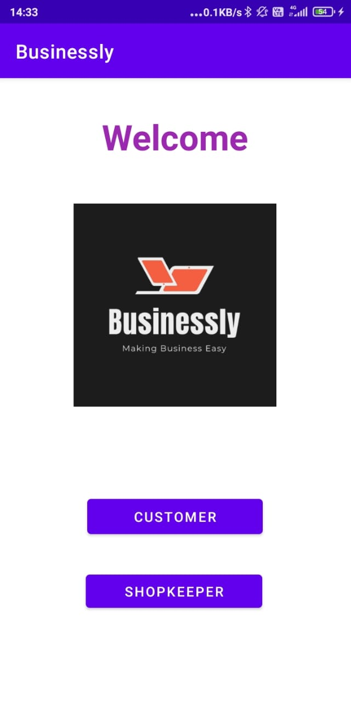
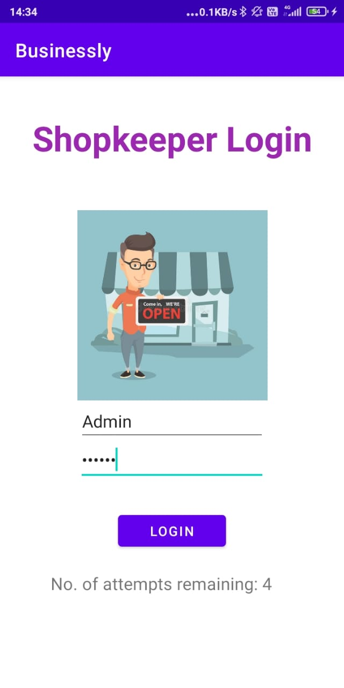
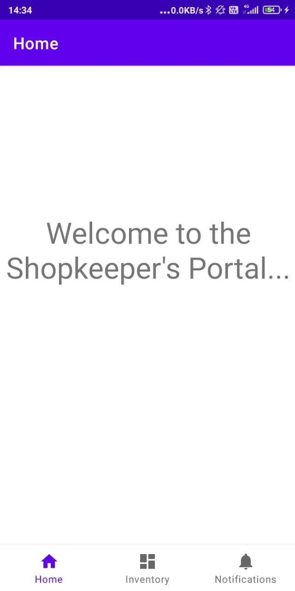
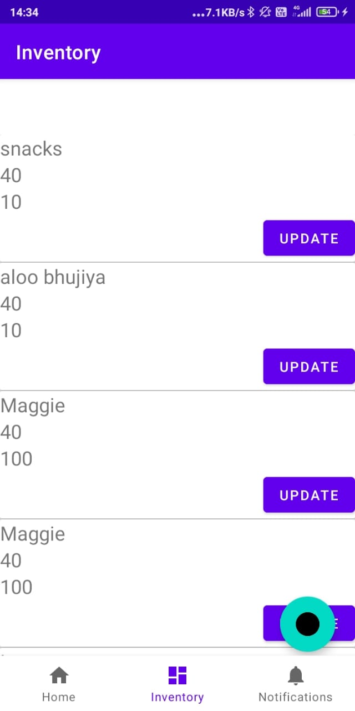
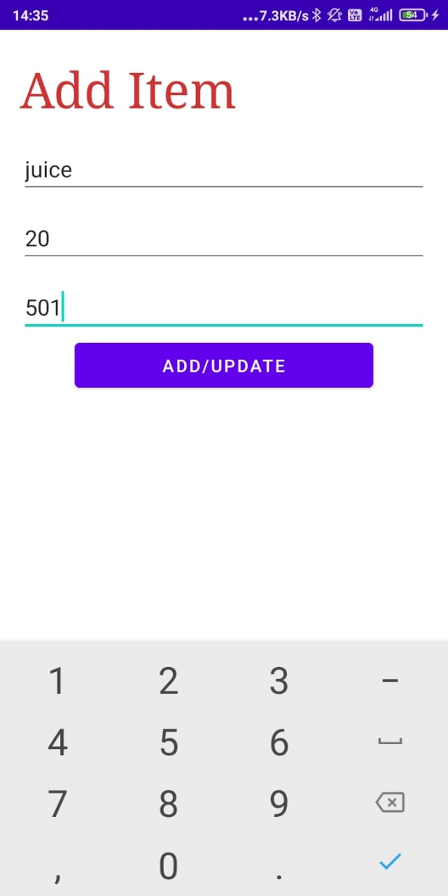
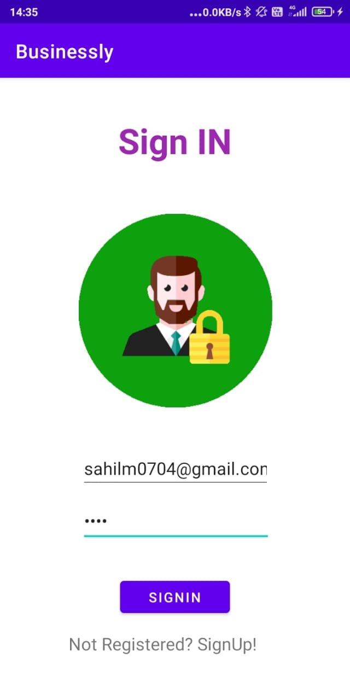
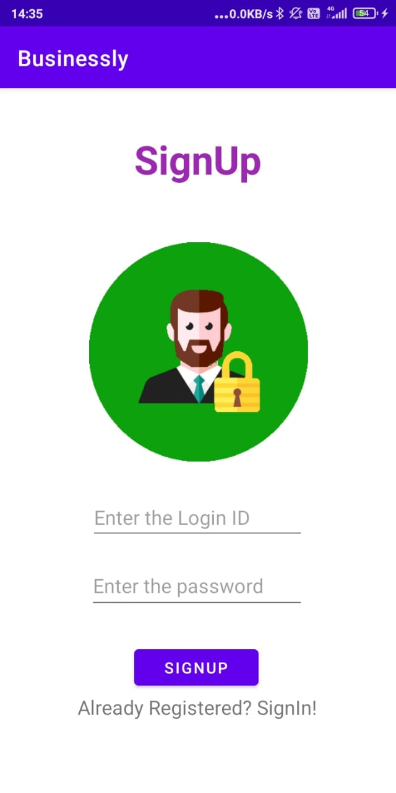
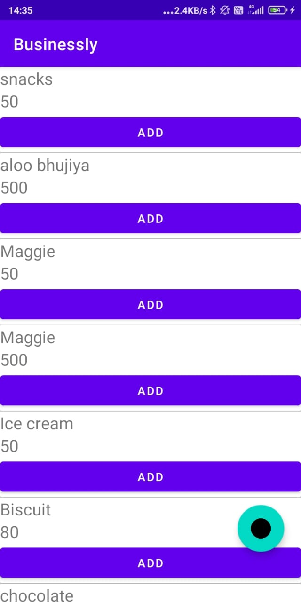
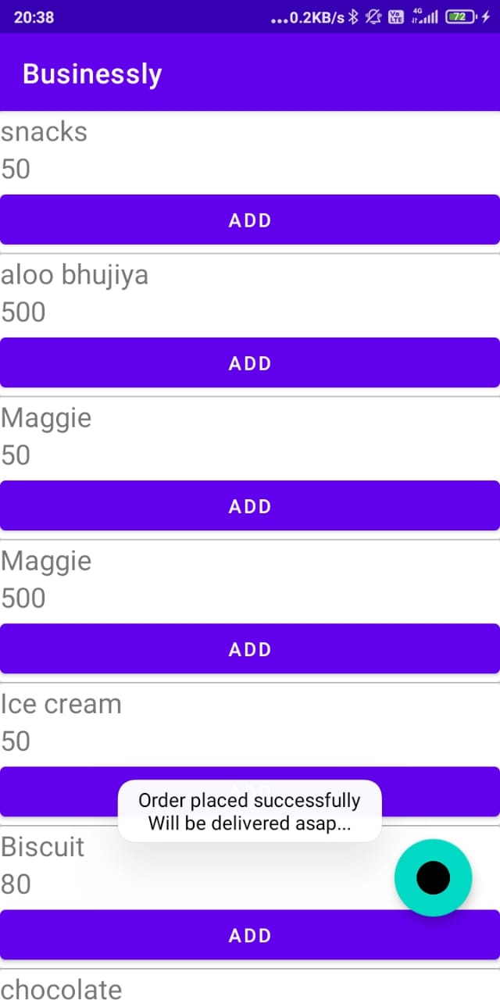

# Businessly
This is an android application to ease the lives of the Retailers and the Customers durning the pandemic.
It is a eCommerce platform built to uplift the local businesses.  

The code has been written in Java language. 

## Video Link
https://drive.google.com/file/d/1Y8cVKStkBZJIe2zefDlV8UZbE1hjh47G/view?usp=sharing

## Tech Stack used.
1. Java
2. Android
3. Android Studio
4. Google FireBase 

## Features-
### Retailer.
1. The Retailer can view and update his stock.
2. The retailer can view the orders in the notification tab in the DashBoard.
3. The Retailer can update the order status once he has processed the order.

### Customer.
1. The Customer can view the items provided by the particular shopkeeper.
2. The Customer can select the set of items that he/she wants to order and preceed.
3. The feature of payment will be added soon.

## ScreenShots

           
     
           
    
    
    

